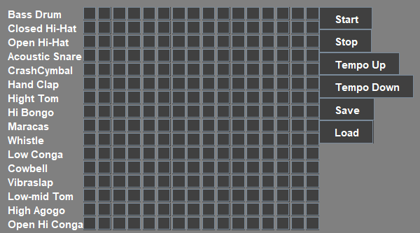
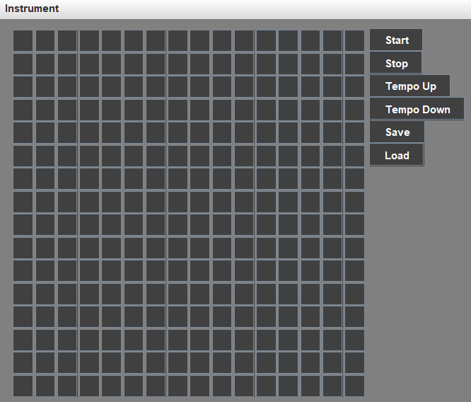
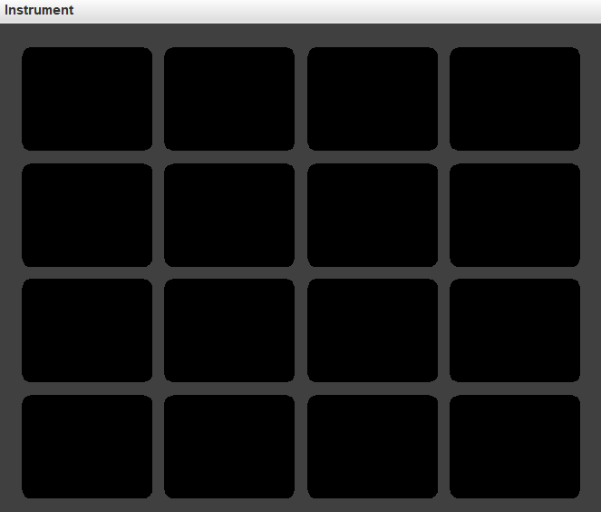
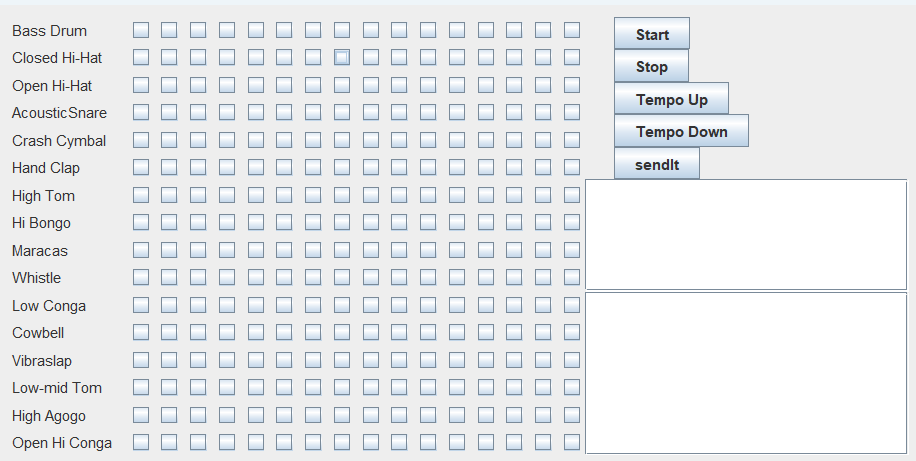

# BeatBoard - A MIDI-based Beat Sequencer



**BeatBoard** is a simple graphical beat sequencer built using Java Swing and MIDI libraries. The program allows you to create rhythmic sequences by toggling instrument buttons on a 16x16 grid. You can start/stop playback, adjust the tempo, and save/load your sequences to/from files.

## Features

- **16x16 Beat Grid**: A grid of toggle buttons where each row represents a different instrument, and each column represents a beat in a sequence.
- **MIDI Playback**: The grid triggers MIDI events, and the beats are played back in real-time using a sequencer.
- **Tempo Control**: Increase or decrease the tempo using the "Tempo Up" and "Tempo Down" buttons.
- **Save/Load Sequences**: Save your beat patterns to a file and load them back later.
- **Instruments**: The sequencer supports 16 different instruments:
  - Bass Drum
  - Closed Hi-Hat
  - Open Hi-Hat
  - Acoustic Snare
  - Crash Cymbal
  - Hand Clap
  - High Tom
  - Hi Bongo
  - Maracas
  - Whistle
  - Low Conga
  - Cowbell
  - Vibraslap
  - Low-mid Tom
  - High Agogo
  - Open Hi Conga

## Installation

1. Clone the repository:
    ```bash
    git clone https://github.com/yourusername/BeatBoard.git
    ```
2. Compile the Java files:
    ```bash
    javac BeatBoard.java
    ```
3. Run the program:
    ```bash
    java BeatBoard
    ```

## Usage

### Controls

- **Start**: Begin playback of the current beat pattern.
- **Stop**: Stop playback.
- **Tempo Up**: Increase the tempo by 3%.
- **Tempo Down**: Decrease the tempo by 3%.
- **Save**: Save the current beat pattern to a file.
- **Load**: Load a previously saved beat pattern.

### Creating a Beat

1. Toggle the buttons in the grid to select beats for each instrument.
2. Press "Start" to hear your pattern.
3. Adjust the tempo using the "Tempo Up" or "Tempo Down" buttons as needed.
4. Save your pattern by clicking the "Save" button. You can load it later using the "Load" button.

## Dependencies

- Java 8 or higher.
- Java MIDI library (javax.sound.midi).
- Java Swing for the graphical user interface (javax.swing).

## How It Works

- The 16x16 grid represents a 16-step sequencer for 16 instruments.
- The `JToggleButton` components are used for the beat grid, where a selected button means a beat is activated for that instrument at that step.
- MIDI events are generated based on the selected grid pattern, and the MIDI sequencer plays them in a loop.
- You can save the state of the grid to a serialized file and load it back later to continue editing or playback.


# BeatPad - MIDI Drum Pad Application


**BeatPad** is a graphical drum pad simulator built with Java Swing and the MIDI library. The application provides a 4x4 grid of buttons that correspond to different drum sounds. Each button, when pressed, plays a different instrument sound using the MIDI synthesizer. The visual effect changes the button color when pressed to simulate a drum pad interface.

## Features

- **4x4 Drum Pad**: A grid of buttons that allows you to play different drum sounds.
- **MIDI Integration**: Plays various percussion instruments using a MIDI synthesizer.
- **Real-Time Interaction**: Button colors change when pressed to provide a visual effect while playing sounds.
- **Customizable Sounds**: Each button triggers a specific drum sound (Bass Drum, Snare, Hi-Hat, etc.).

## Instruments

Each button on the grid plays one of the following MIDI percussion instruments:

- Bass Drum (35)
- Closed Hi-Hat (42)
- Open Hi-Hat (46)
- Acoustic Snare (38)
- Crash Cymbal (49)
- Hand Clap (39)
- High Tom (50)
- Hi Bongo (60)
- Maracas (70)
- Whistle (72)
- Low Conga (64)
- Cowbell (56)
- Vibraslap (58)
- Low-mid Tom (47)
- High Agogo (67)
- Open Hi Conga (63)

## Installation

1. Clone the repository:
    ```bash
    git clone https://github.com/yourusername/BeatPad.git
    ```
2. Compile the Java files:
    ```bash
    javac BeatPad.java
    ```
3. Run the program:
    ```bash
    java BeatPad
    ```

## Usage

1. **Launch the Application**: Run the program to open the 4x4 grid of drum pad buttons.
2. **Play Sounds**: Click any button to play its corresponding percussion sound.
3. **Visual Feedback**: Each button changes color to yellow when pressed and reverts back to black when released.

## Dependencies

- Java 8 or higher.
- Java MIDI library (javax.sound.midi).
- Java Swing for the graphical user interface (javax.swing).

## How It Works

- The drum pad consists of 16 `ColorChangeButton` components arranged in a grid layout.
- Each button is tied to a specific MIDI percussion instrument and plays a sound when clicked.
- MIDI synthesizer is set up via the `Synthesizer` and `MidiChannel` classes, with channel 9 being used for percussion.
- Button colors change dynamically between black (unpressed) and yellow (pressed) to simulate drum pad functionality.


# TestApplication - Combined BeatOffice (BeatPad & BeatBoard)




**TestApplication** is a Java Swing-based GUI application that combines two music production tools: **BeatBoard** and **BeatPad**. Both of these tools allow users to interact with MIDI instruments, with **BeatBoard** offering a sequencer grid and **BeatPad** providing a real-time drum pad interface. The application utilizes a card layout to switch between the two components via a menu.

## Features

- **BeatPad Integration**: Real-time MIDI drum pad that allows users to play various percussion sounds using a 4x4 grid of buttons.
- **BeatBoard Integration**: Step-sequencer where users can create loops by toggling on/off instruments on a 16x16 grid.
- **Menu Navigation**: Easily switch between **BeatPad** and **BeatBoard** via the menu.
- **MIDI Support**: Both interfaces allow playing and controlling MIDI instrument sounds.

## Components

### 1. **BeatPad (BeatOffice2)**
- Provides a real-time MIDI drum pad experience.
- Each button plays a percussion instrument when clicked.
- Includes instruments like Bass Drum, Snare, Hi-Hat, and Cymbals.

### 2. **BeatBoard (BeatOffice)**
- A 16x16 step-sequencer allowing users to build loops.
- Users can toggle individual steps on or off to build rhythmic patterns.
- Features controls for start/stop, tempo adjustment, save/load functionality for patterns.

## Instruments in Both Interfaces

Each button corresponds to one of the following MIDI percussion instruments:
- Bass Drum (35)
- Closed Hi-Hat (42)
- Open Hi-Hat (46)
- Acoustic Snare (38)
- Crash Cymbal (49)
- Hand Clap (39)
- High Tom (50)
- Hi Bongo (60)
- Maracas (70)
- Whistle (72)
- Low Conga (64)
- Cowbell (56)
- Vibraslap (58)
- Low-mid Tom (47)
- High Agogo (67)
- Open Hi Conga (63)

## Installation

1. Clone the repository:
    ```bash
    git clone https://github.com/yourusername/TestApplication.git
    ```
2. Compile the Java files:
    ```bash
    javac TestApplication.java
    ```
3. Run the program:
    ```bash
    java TestApplication
    ```

## Usage

1. **Launch the Application**: Run the program to open the main window.
2. **Switch Between Interfaces**: Use the menu to navigate between **BeatPad** and **BeatBoard**.
  - **BeatPad** (via "BeatPad" menu item) provides a 4x4 grid for real-time drum playing.
  - **BeatBoard** (via "BeatBoard" menu item) provides a sequencer grid for creating patterns.
3. **Play Sounds and Patterns**:
  - In **BeatPad**, click the buttons to play different percussion sounds.
  - In **BeatBoard**, toggle buttons to create rhythmic loops and control playback with the Start/Stop button.
4. **Save and Load Patterns**: In **BeatBoard**, save your sequence to a file or load an existing one.

## Dependencies

- Java 8 or higher.
- Java MIDI library (javax.sound.midi).
- Java Swing for the graphical user interface (javax.swing).

## How It Works

- **CardLayout for Switching Views**: The app uses a `CardLayout` to allow seamless switching between **BeatPad** and **BeatBoard**.
- **BeatBoard**: A grid of `JToggleButton` elements lets users create rhythm patterns that are played using the MIDI sequencer.
- **BeatPad**: Consists of `JButton` elements that act like drum pads, triggering different percussion instruments in real time.
- **MIDI Support**: Both components interact with a `MidiChannel` and a `Sequencer` to play MIDI sounds.


# BeatOfficeMain - Cyber BeatBox



BeatOfficeMain is a Java-based music creation app that lets users play, edit, and share rhythm sequences. Users can create and control various MIDI instruments through an intuitive graphical interface, allowing for collaborative music creation.

## Features

- **16x16 Grid Interface**: Create beats using checkboxes for 16 different instruments.
- **MIDI Support**: Uses Java MIDI to play and sequence beats.
- **Real-Time Interaction**: Start, stop, and adjust tempo in real-time.
- **Save and Share**: Send beat sequences to other users and play shared sequences.
- **Remote Collaboration**: Connect to a server to collaborate on beats with other users.

## Instruments
- Bass Drum
- Closed Hi-Hat
- Open Hi-Hat
- Acoustic Snare
- Crash Cymbal
- Hand Clap
- High Tom
- Hi Bongo
- Maracas
- Whistle
- Low Conga
- Cowbell
- Vibraslap
- Low-mid Tom
- High Agogo
- Open Hi Conga

## Requirements

- Java JDK 8 or above
- MIDI sound support (included with Java SE)
- A server for remote collaboration (optional, default is localhost on port 4242)

## How to Run

1. **Clone the Repository**:
    ```bash
    git clone https://github.com/your-username/beat-office2.git
    ```

2. **Compile the Code**:
    ```bash
    javac BeeatOfficeMain.java
    ```

3. **Run the Application**:
   To start the app:
    ```bash
    java BeeatOfficeMain
    ```
    - This will generate a random user ID for you.
    - If you want to specify a username, you can pass it as an argument:
    ```bash
    java BeeatOfficeMain [YourUserName]
    ```

4. **Server Connection**:
   By default, the app connects to `localhost:4242`. If you want to run a server, set up your socket connection and ensure it's running on the specified port.

## Usage

- **Create Beats**: Select or deselect checkboxes to create a rhythm. Each checkbox corresponds to an instrument in one of the 16 steps of the sequence.
- **Start/Stop**: Use the buttons to start or stop the playback.
- **Change Tempo**: Click "Tempo Up" or "Tempo Down" to adjust the playback speed.
- **Share Beats**: Type a message and click "sendIt" to share your beat with connected users.

## Remote Collaboration

- Users can connect to a server, share beats, and load sequences created by other users. Make sure the server is running and accessible via the IP address `127.0.0.1` on port `4242` or modify this in the `BeeatOfficeMain` class.

## Contributing

Feel free to contribute to BeatOffice2! Here’s how you can get started:
1. Fork the repository.
2. Create a new branch: `git checkout -b feature-name`.
3. Make your changes.
4. Submit a pull request.


# BeatOfficeMain Server

BeatOfficeMain Server is a Java-based server that enables real-time collaboration for the BeatOffice2 music creation application. It handles connections from multiple clients and facilitates the sharing of beat sequences between users.

## Features

- **Client Management**: Accepts connections from multiple clients and maintains a list of connected clients.
- **Real-Time Collaboration**: Broadcasts beat sequences and messages to all connected clients.
- **Object-Based Communication**: Uses Java object streams to transmit complex data between clients and the server.

## Requirements

- Java JDK 8 or above
- Network socket access on port 4242

## How to Run

1. **Clone the Repository**:
    ```bash
    git clone https://github.com/your-username/beat-office2-server.git
    ```

2. **Compile the Server Code**:
    ```bash
    javac BeatOfficeServer.java
    ```

3. **Run the Server**:
    ```bash
    java BeatOfficeServer
    ```

   The server will start and listen for incoming client connections on port 4242.

## How it Works

1. **Client Connections**:
    - The server listens on port 4242 for incoming client connections.
    - Each client that connects is assigned an `ObjectOutputStream` to send data back to the client and an `ObjectInputStream` to receive data from the client.
    - A new thread is spawned for each connected client, ensuring simultaneous communication with all users.

2. **Broadcasting Messages**:
    - The server reads two objects from each client: the user's message and the current state of their beat sequence.
    - These objects are broadcast to all connected clients using the `tellEveryone()` method, ensuring synchronized collaboration.

## Example Flow

1. Start the server:
    ```bash
    java BeatOfficeServer
    ```

2. Multiple clients will connect to the server and share their beat sequences.

3. The server will distribute these beat sequences to all other connected clients in real-time.

## Contributing

Feel free to contribute to BeatOffice2 Server! Here’s how you can get started:
1. Fork the repository.
2. Create a new branch: `git checkout -b feature-name`.
3. Make your changes.
4. Submit a pull request.

## License

This projects is licensed under the MIT License. See the [LICENSE](LICENSE) file for details.

## Author

- Beqa Kopadze
